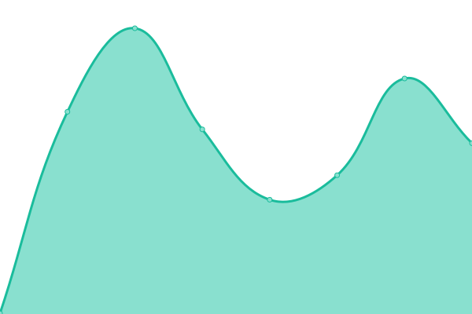
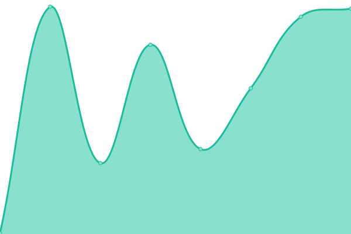

# [📈 Live Status](https://status.diogomachado.pt): <!--live status--> **🟩 All systems operational**

This repository contains the open-source uptime monitor and status page for [Diogo Machado](https://www.diogomachado.pt/), powered by [Upptime](https://github.com/upptime/upptime).

With [Upptime](https://upptime.js.org), you can get your own unlimited and free uptime monitor and status page, powered entirely by a GitHub repository. We use [Issues](https://github.com/diogoalexsmachado/upptime-diogomachado.pt/issues) as incident reports, [Actions](https://github.com/diogoalexsmachado/upptime-diogomachado.pt/actions) as uptime monitors, and [Pages](https://status.diogomachado.pt) for the status page.

<!--start: status pages-->
<!-- This summary is generated by Upptime (https://github.com/upptime/upptime) -->
<!-- Do not edit this manually, your changes will be overwritten -->
<!-- prettier-ignore -->
| URL | Status | History | Response Time | Uptime |
| --- | ------ | ------- | ------------- | ------ |
|  [Personal Website](https://www.diogomachado.pt) | 🟩 Up | [personal-website.yml](https://github.com/diogoalexsmachado/upptime-diogomachado.pt/commits/HEAD/history/personal-website.yml) | 

 515ms
     
 | 

<a href="https://status.diogomachado.pt/history/personal-website">100.00%</a>
    

|  [TBK Digital Labs Website](https://www.tbk.digital) | 🟩 Up | [tbk-digital-labs-website.yml](https://github.com/diogoalexsmachado/upptime-diogomachado.pt/commits/HEAD/history/tbk-digital-labs-website.yml) | 

 232ms
     
 | 

<a href="https://status.diogomachado.pt/history/tbk-digital-labs-website">100.00%</a>
    

|  [João's Portfolio Page](https://joao.tbk.digital) | 🟩 Up | [joao-s-portfolio-page.yml](https://github.com/diogoalexsmachado/upptime-diogomachado.pt/commits/HEAD/history/joao-s-portfolio-page.yml) | 

 197ms
     
 | 

<a href="https://status.diogomachado.pt/history/joao-s-portfolio-page">100.00%</a>
    

<!--end: status pages-->

[**Visit our status website →**](https://status.diogomachado.pt)

## 📄 License

- Powered by: [Upptime](https://github.com/upptime/upptime)
- Code: [MIT](./LICENSE) © [Diogo Machado](https://www.diogomachado.pt/)
- Data in the `./history` directory: [Open Database License](https://opendatacommons.org/licenses/odbl/1-0/)
